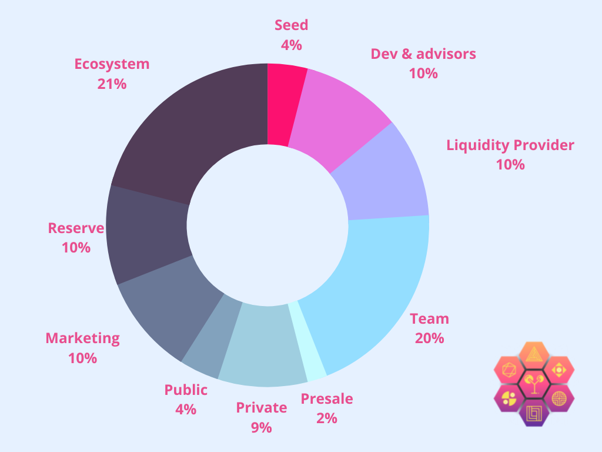
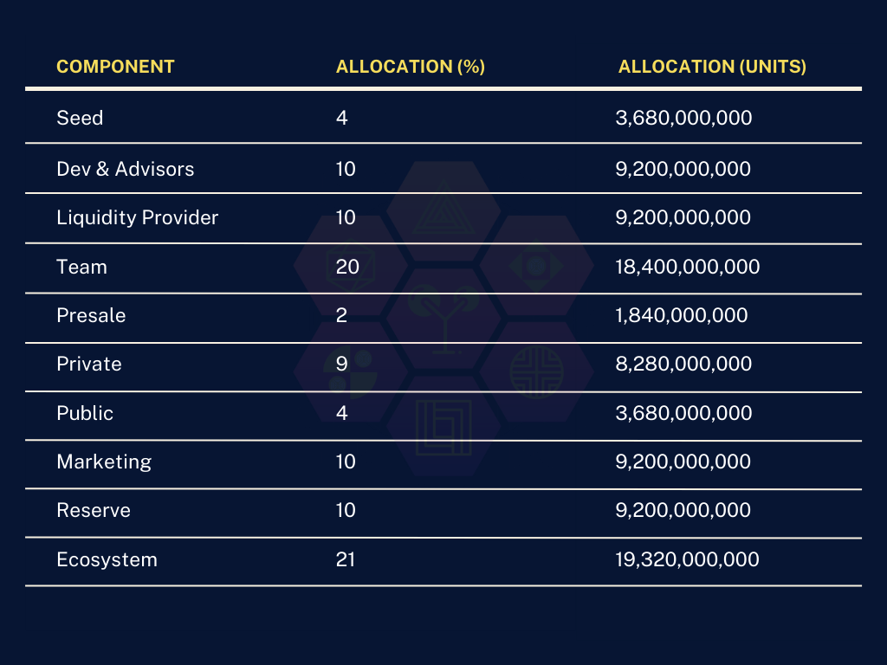

```mdx-code-block
import BrowserWindow from '@site/src/components/BrowserWindow';
import Tabs from '@theme/Tabs';
import TabItem from '@theme/TabItem';
import styles from './markdown-features-styles.module.css';
```

<p>
  Yumpie powers an open and collaborative platform called Yo! Student. Yo! Student enable developers to better utilise and monetize user access data and create better Web3 solutions. Yumpie intends to return data control to the community while simultaneously making it simple to locate talented individuals to create IoT solutions.
  Yo! Student is a community-centred technology built to provide scalable, user-friendly tools for innovators around the world. Native blockchain protocol that supports collaborative development of blockchain-based projects. Take control of the lifecycle of your businesses and projects with real-world industry-leading digital infrastructure. Each partnership begins with the evaluation and selection of the best collaborators. Yumpie technology simplifies the process of partner selection, agreement formation, and projects execution. Validate each other using the power of blockchain.
</p>

<p>
  In September 2022, Yumpie declared a total and maximum quantity of 92,000,000,000 YUM tokens during the initial coin offering (ICO) for the tokens. As of mid-September 2022, there were around 23,000,000,000 YUM tokens in circulation, or about 25% of the entire supply. There are 920 million YUM tokens available for purchase at the Yumpie ICO, at a price of $0.001 per token.
</p>
<p>
  <h2>How Is the Yumpie Network Secured?</h2>
  <h3>How Secure Is the Yumpie Network?</h3>
  Yumpie is a multi-chain token that is backed by the proof-of-stake (PoS) consensus protocol. PoS relies on the quantity of staked tokens for choosing node validators, in contrast to Bitocin's proof-of-work (PoW) consensus.
  In order to combat the enormous power consumption required by PoW devices, PoS protocols were developed. PoS models are becoming and more common since they require less electricity and are simple to scale. PoW has established itself as a trustworthy consensus mechanism, yet Ethereum, Binance Smart Chain, Polygon, and Solana coins are dominating the market and increasing quickly.
</p>
<p>
  <h2>What Makes Chainlink Unique?</h2>
  Yumpie powers a Virtual Learning Platform built to provide user-friendly educational tools for blockchain pioneers. 
</p>


## The total token supply of YUM is 92M total supply accross four chains; 23M each token. 

### All users who participate in the ICO will receive equal amounts of tokens purchase across all chains in Round 1-5 of the ICO. 



```mdx-code-block
<BrowserWindow>
  <Tabs>
    <TabItem value="ethereum" label="Ethereum">    
      <h2>25% Ethereum </h2>      
      <h3>Seed 4% - 920,000,000 </h3>
      <br/>
      <h3>Dev & Advisors 10% - 2,300,000,000 </h3>
      <br/>
      <h3>Liquidity Provider 10% - 2,300,000,000 </h3>
      <br/>
      <h3>Team 20% - 4,600,000,000 </h3>
      <br/>
      <h3>Presale 2% - 460,000,000 </h3>
      <br/>
      <h3>Private 9% - 2,070,000,000 </h3>
      <br/>
      <h3>Public 4% - 920,000,000  </h3>
      <br/>
      <h3>Marketing 10% - 2,300,000,000 </h3>
      <br/>
      <h3>Reserve 10% - 2,300,000,000 </h3>
      <br/>
      <h3>Ecosystem 21% - 4,830,000,000 </h3>
      <br/>
    </TabItem>
    <TabItem value="binance smart chain" label="Binance Smart Chain">
      <h2>25% Binance Smart Chain </h2>
      <h3>Seed 4% - 920,000,000 </h3>
      <br/>
      <h3>Dev & Advisors 10% - 2,300,000,000 </h3>
      <br/>
      <h3>Liquidity Provider 10% - 2,300,000,000 </h3>
      <br/>
      <h3>Team 20% - 4,600,000,000 </h3>
      <br/>
      <h3>Presale 2% - 460,000,000 </h3>
      <br/>
      <h3>Private 9% - 2,070,000,000 </h3>
      <br/>
      <h3>Public 4% - 920,000,000  </h3>
      <br/>
      <h3>Marketing 10% - 2,300,000,000 </h3>
      <br/>
      <h3>Reserve 10% - 2,300,000,000 </h3>
      <br/>
      <h3>Ecosystem 21% - 4,830,000,000 </h3> 
      <br/>
    </TabItem>
    <TabItem value="polygon" label="Polygon">
      <h2>25% Polygon Matic </h2>
      <h3>Seed 4% - 920,000,000 </h3>
      <br/>
      <h3>Dev & Advisors 10% - 2,300,000,000 </h3>
      <br/>
      <h3>Liquidity Provider 10% - 2,300,000,000 </h3>
      <br/>
      <h3>Team 20% - 4,600,000,000 </h3>
      <br/>
      <h3>Presale 2% - 460,000,000 </h3>
      <br/>
      <h3>Private 9% - 2,070,000,000 </h3>
      <br/>
      <h3>Public 4% - 920,000,000  </h3>
      <br/>
      <h3>Marketing 10% - 2,300,000,000 </h3>
      <br/>
      <h3>Reserve 10% - 2,300,000,000 </h3>
      <br/>
      <h3>Ecosystem 21% - 4,830,000,000 </h3>
      <br/>
    </TabItem>
    <TabItem value="solana" label="Solana">
      <h2>25% Solana </h2>
      <h3>Seed 4% - 920,000,000 </h3>
      <br/>
      <h3>Dev & Advisors 10% - 2,300,000,000 </h3>
      <br/>
      <h3>Liquidity Provider 10% - 2,300,000,000 </h3>
      <br/>
      <h3>Team 20% - 4,600,000,000 </h3>
      <br/>
      <h3>Presale 2% - 460,000,000 </h3>
      <br/>
      <h3>Private 9% - 2,070,000,000 </h3>
      <br/>
      <h3>Public 4% - 920,000,000  </h3>
      <br/>
      <h3>Marketing 10% - 2,300,000,000 </h3>
      <br/>
      <h3>Reserve 10% - 2,300,000,000 </h3>
      <br/>
      <h3>Ecosystem 21% - 4,830,000,000 </h3>
      <br/>
    </TabItem>
  </Tabs>
</BrowserWindow>
```


