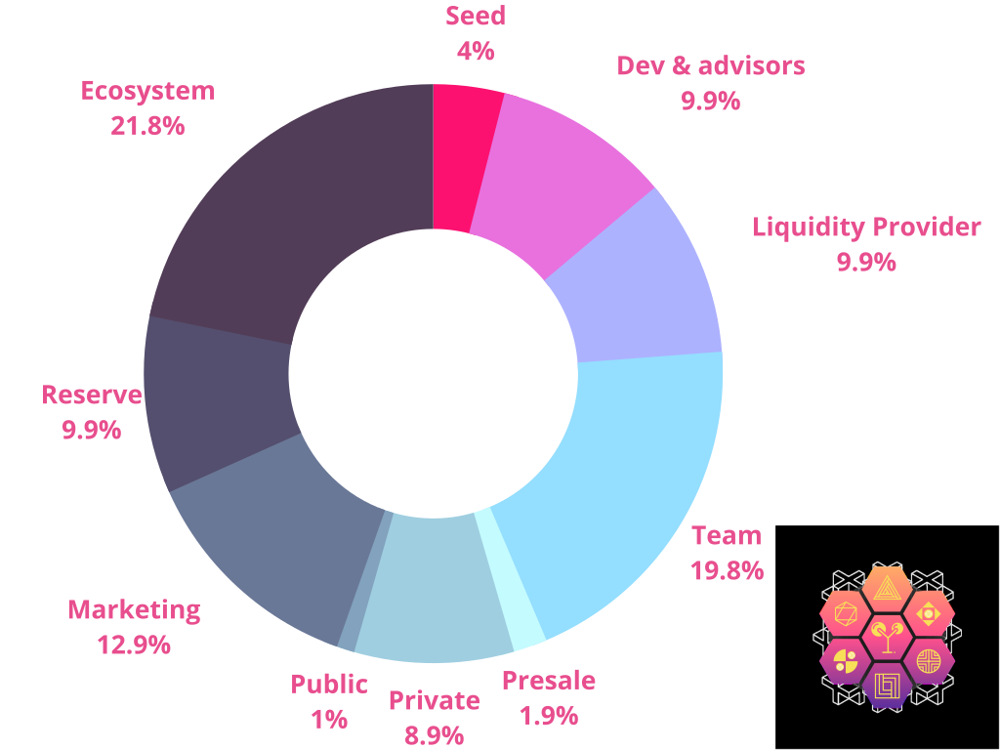

```mdx-code-block
import BrowserWindow from '@site/src/components/BrowserWindow';
import Tabs from '@theme/Tabs';
import TabItem from '@theme/TabItem';
import styles from './markdown-features-styles.module.css';
```


## The total token supply of YUM is 23,000,000,000 units

```mdx-code-block
<BrowserWindow>
  <Tabs>
    <TabItem value="ethereum" label="Ethereum">
      ## Seed
       ### 230,000,000 
      ## Dev & Advisors
       ### 569,250,000
      ## Liquidity Provider
       ### 569,250,000
      ## Team
       ### 1,138,500,000
      ## Presale
       ### 109,250,000
      ## Private
       ### 511,750,000
      ## Public
       ### 57,500,000
      ## Marketing
       ### 741,750,000
      ## Reserve
       ### 569,250,000
      ## Ecosystem   
       ### 1,253,500,000
    </TabItem>
    <TabItem value="binance smart chain" label="Binance Smart Chain">
     ## Seed
       ### 230,000,000 
      ## Dev & Advisors
       ### 569,250,000
      ## Liquidity Provider
       ### 569,250,000
      ## Team
       ### 1,138,500,000
      ## Presale
       ### 109,250,000
      ## Private
       ### 511,750,000
      ## Public
       ### 57,500,000
      ## Marketing
       ### 741,750,000
      ## Reserve
       ### 569,250,000
      ## Ecosystem   
       ### 1,253,500,000
    </TabItem>
    <TabItem value="polygon" label="Polygon">
     ## Seed
       ### 230,000,000 
      ## Dev & Advisors
       ### 569,250,000
      ## Liquidity Provider
       ### 569,250,000
      ## Team
       ### 1,138,500,000
      ## Presale
       ### 109,250,000
      ## Private
       ### 511,750,000
      ## Public
       ### 57,500,000
      ## Marketing
       ### 741,750,000
      ## Reserve
       ### 569,250,000
      ## Ecosystem   
       ### 1,253,500,000
    </TabItem>
    <TabItem value="solana" label="Solana">
     ## Seed
       ### 230,000,000 
      ## Dev & Advisors
       ### 569,250,000
      ## Liquidity Provider
       ### 569,250,000
      ## Team
       ### 1,138,500,000
      ## Presale
       ### 109,250,000
      ## Private
       ### 511,750,000
      ## Public
       ### 57,500,000
      ## Marketing
       ### 741,750,000
      ## Reserve
       ### 569,250,000
      ## Ecosystem   
       ### 1,253,500,000
    </TabItem>
  </Tabs>
</BrowserWindow>
```


