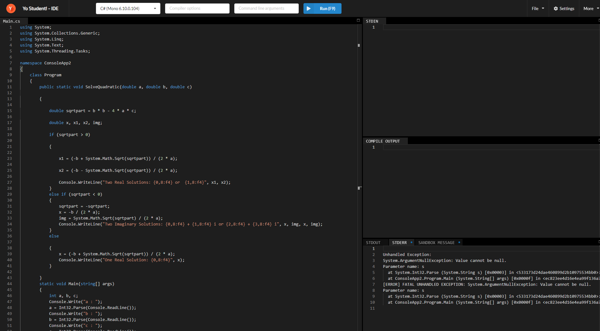

### 🎶Showroom & Blogging⚽
Yumpie's NFT marketplace, powered by YUM, is incorporated into Yostudent VLE to meet the crypto communities' growing NFT-centric needs. Yumpie NFT Marketplace is special in the sense that it offers the following benefits in addition to the standard NFT features:

* For crypto artists, the NFT showroom is must-see. Yumpie's social profile can be utilised as a personal NFT showroom, displaying the community's premium NFT collections.

* Ecosystem of Social-NFT Cryptography When a decentralised wallet is linked to the NFT marketplace, several social features become available, including the ability to share NFTs on Yumpie social media for additional promotion and exposure.

* The platform provides each Yumpie account with a customisable social NFT that will serve as an avatar-like biography on Yumpie. The NFT can be personalised with a variety of cosmetics (from other projects) and Yumpie account activity, such as number of followers, Shard counts, project completion rate and so on.

## YoStudent.com


### 💎AskSaru - Chat with AI 👨‍💻


 ### 🏎Study Tools 🏛


### 🤓News 📑


### 📱Library 🏛


### 👩🏽‍🤝‍🧑🏿Calender 📅


### 🕸Board 📒


### 🔦Search🔎
Find the exact results you need for you business or academic projects 


### 🦾IDE 👩‍💻 



### 🔐Smart Contract Generator🧾 


### 📚Document Editing📝 


### 🎥Video Conferencing/Classrooms/Group Studyroom🚄 


### 🚀Hub 🏙
YoStudent Hub is a launchpad feature created on YoStudent platform. The Hub gives access and introduces a new crowdfunding concept, in which projects can back the YoStudent series with their own native tokens as well as Yumpie's native token, YUM.


Yumpie and the issuing projects can collaborate more closely thanks to the NFT-backing model, which also connects the communities' interest in the NFT launch event on both sides.

The NFT launchpad also contributes to YUM's token utility, as a set amount of YUM must be purchased from the market and burned before it can be used by any project.
Tools

### 🚀NFT🛰 
Get a closer look at Yumpie's Exclusive Rare & Ultra Rare NFTs. A total of 23 NFTs to be released. 2,300 mintable for the first 22 Editions. For the 23rd Edition, Only 23 will be released for (auction).


```bash
More Features (In development)
```
