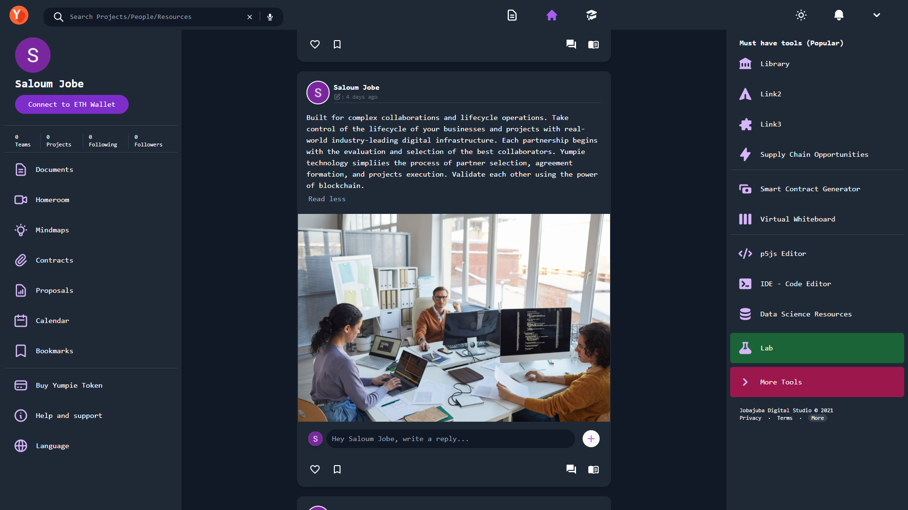
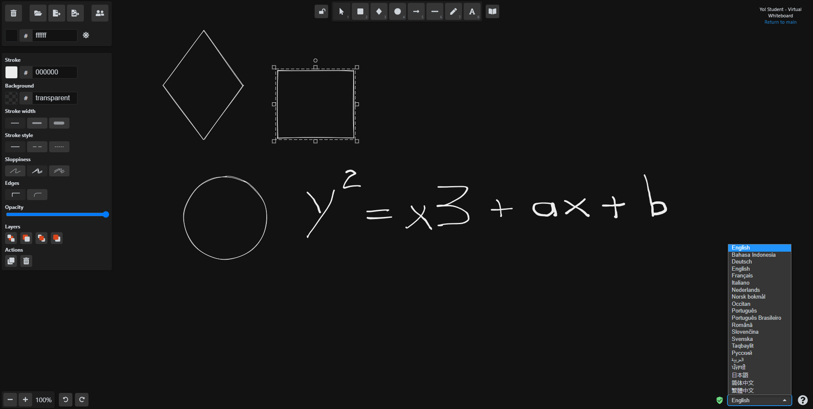
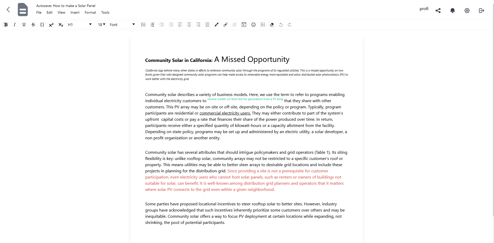
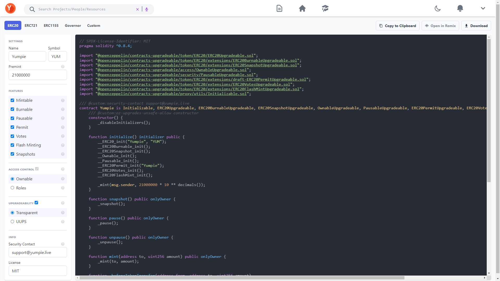

# Introduction

# Welcome to yumpie

Technology created with the community in mind to deliver scalable, user-friendly instructional tools to entrepreneurs all around the world. Yo! Student Protocol uses a Hyperledger-based native blockchain to facilitate collaborative development of blockchain-based products.

Decentralized social media is still a novel technology that is changing the way people share information, therefore the future appears bright.
You'll never have to worry about counter productivity or scaling again after you've integrated. An all-in-one cloud-based solution that enables small-scale, personal, and often impersonal text, sound, and video communication channels. As the network scales, the Yumpie expanding ecosystem maintains a single global state, ensuring composability between ecosystem projects. Working with redundant storage or fragmented system configurations is never a good idea.

## The Yostudent powered by Yumpie protocol is made up of five main components:
#### 1 Social 
Community-centred technology built to provide scalable, user-friendly educational tools for innovators around the world. Hyperledger-based native blockchain for the Yo! Student Protocol that supports collaborative development of blockchain-based projects.
#### 2 Virtual learning
Cloud-based document editing, virtual classrooms - free browser based real-time video conference and other essential education centered features. 
#### 3 NFT
Get a closer look at Yumpie&#44;s Exclusive Rare &amp Ultra Rare NFTs. A total of 23 NFTs to be released. 2,300 mintable for the first 22 Editions. For the 23rd Edition, Only 23 will be released for (auction).
#### 4 DeFi
Decentralised finance (DeFi) proposed as a new kind of crypto market intermediation. Innovative automated protocols on blockchains to support trading, lending, and investment of cryptoassets, as well as stablecoins that facilitate financial transfers are crucial components of this ecosystem.
#### 5 Metaverse
Designed to function with 3D virtual world networks centred on social interaction. It is sometimes defined as a hypothetical iteration of the Internet as a single, universal virtual environment that is assisted by the usage of virtual and augmented reality.

## Learning and Social Networking Platform
Dapp built to provide scalable, user-friendly educational tools for the world. Hyperledger-based native blockchain for YoStudent Protocol and Yumpie Token (TUM)

### Low Cost Real-Time Transactions
Real-time transactions at a very low cost. Scalability ensures transactions remain affordable for both all users. Share your ideas with the world.

# Protect Your Intellectual Property
Sign you ideas and projects forever in the blockchain. Brand, reputation and intellectual property (IP) affect everyone. Get the maximum protection for your knowhow or creative output.

### Increases the transparency when monitising projects, hobby and idea
Quickly and efficiently deploy transparent and self-executing contracts, by generating automated smart contracts as development standard solutions. This secures the rights of contributors to the project using Yumpie Protocol.

### Joint control over the shared projects and information
Simplify partnership and develop a successful product. Communicate, exchange information, and coordinate work with engineers, designers, customers, and suppliers in your own unique ecosystem.

# Built for complex collaborations and lifecycle operations
Take control of the lifecycle of your businesses and projects with real-world industry-leading digital infrastructure. Each partnership begins with the evaluation and selection of the best collaborators. Yumpie technology simpliies the process of partner selection, agreement formation, and projects execution. Validate each other using the power of blockchain.

### Maximum security that ensures total privacy
End-to-end state-of-the-art encryption means more secure meetings and classrooms. All of your communications is secure. End to end state of the art encryption means your participants are exactly that. Your calls.

### Live streaming, chat, file sharing and more
Share your screen, application window, present your documents, slides and more. Simple collaborative whiteboard to draw and explain your concepts to the other participants in the meeting. File Sharing. Share any types of files to all participants in the meeting, in total security, thanks to Datagram Transport Layer Security (DTLS).

### Unlimited number of conference rooms without call time limitation
Share your screen, application window, present your documents, slides and more. Having the webcam on, allows participants to make a deeper connection with you. Up to 4k resolution. Chat with others in meeting, either public chat or private, save the meeting messages. Integrated emoji picker to show your feeling.

# All-in-one business management solution
From easy to use and legally verified contract templates to smart invoices designed to cut the time it takes to get paid and get you paid without chasing clients. Everything is autosaved as you type. All you assignments safe and secure in one place. No need to worry about looking your work ever again. YoStudent has it all. A virtual learning platform that eleminates the need to download and install multiple software. Sign messages, images and more. Sign it and you said it first. It's yours forever.

# Smart Contract Generator
The OpenZeppelin Smart Contract Generator is an easy-to-use interface to the public interface of OpenZeppelin, a framework for writing smart contracts as well as other blockchain development tools.

OpenZeppelin Smart Contract Generator is a community driven tool that enables developers to create smart contracts using Zeppelin libraries. It is decentralized and open source, with strong guarantees provided by the Ethereum blockchain. A toolbox for smart contract deployment, development and management. With a simple interface and intuitive drag-and-drop functionality, you can deploy your own digital assets with ease.

