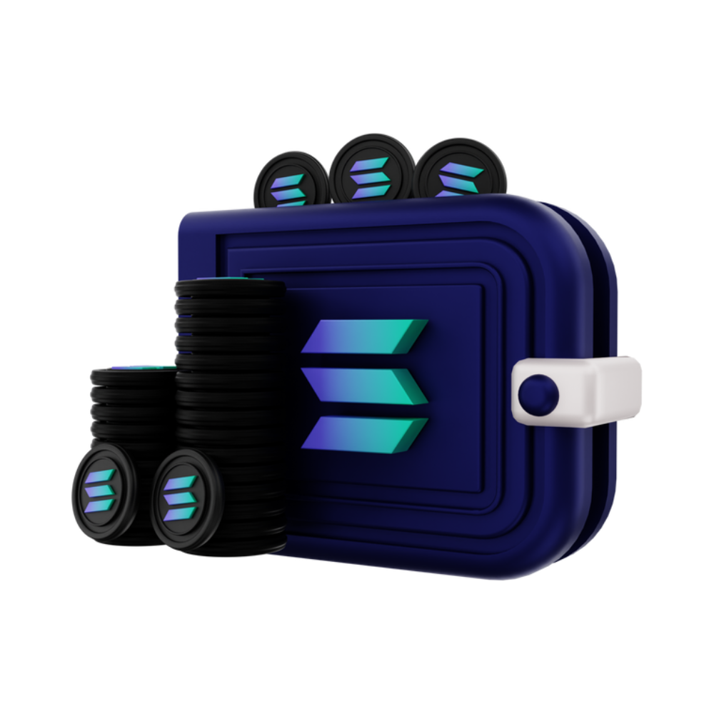

## Total supply 23 Billion across multiple chains. 

Ethereum: 
>:white_check_mark:[Total supply 5,750,000,000](https://etherscan.io/)
```bash
Contract Address: 
```
{height=50px width=50px}

Binance Smart Chain: 
>:white_check_mark:[Total supply 5,750,000,000](https://bscscan.com/)
```bash
Contract Address: 
```


Polygon: 
>:white_check_mark:[Total supply 5,750,000,000](https://polygonscan.com/)
```bash
Contract Address: 
```


Solana: 
>:white_check_mark:[Total supply 5,750,000,000](https://solanascan.io/)
```bash
Contract Address: 
```

