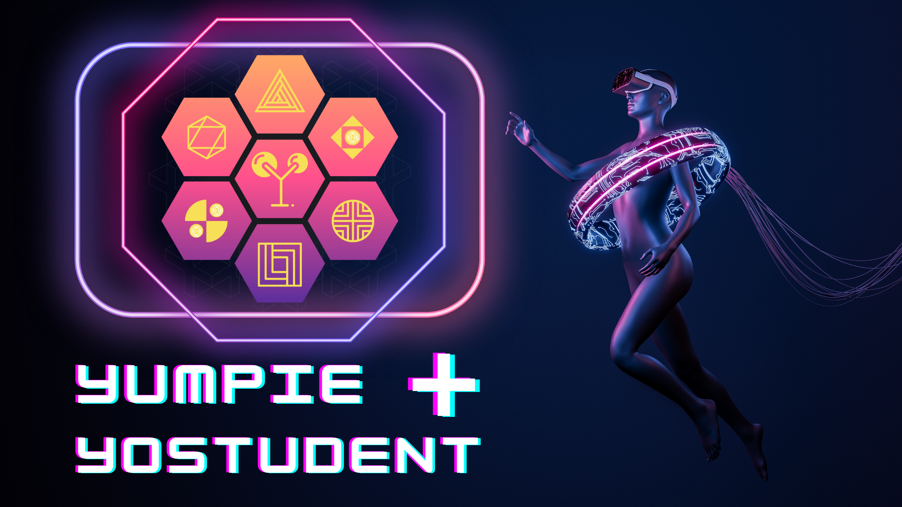

# Introduction

The blockchain is a disruptive technology that is changing the way people interact with each other and share information. The most well-known application of the blockchain is cryptocurrency; Bitcoin and other cryptocurrencies are based on the blockchain technology. But the blockchain is much more than just cryptocurrency; it is a disruptive technology that is changing the way people interact with each other and share information. The blockchain is an open, distributed ledger technology that was first introduced as part of the cryptocurrency Bitcoin. The blockchain is a digital database that is decentralized; this means that it is not controlled by any single entity or organization.

Social media has changed the way we communicate, share ideas, and feel connected to one another. But as the world has become more digital, the current social landscape has become increasingly centralized, with a handful of companies controlling our online experiences. In the process, this has created a web of privacy and censorship concerns, as well as failed to address the needs of the many in our society who don't have access to the internet. But instead of continuing down the same path, we can build a better future together.

Decentralised social media is becoming more and more popular, with social media giants like Facebook and Twitter losing their grip on users. The first decentralized social media platform, called Mastodon, was founded in 2016, and since then a host of other platforms have been set up to provide users with an alternative to the current social media landscape. Wikipedia describes a social media platform as "software-based services and applications which provide small-scale, personal, and often-impersonal communication channels for text, sound, and video communications

Decentralised social technology is the next step in social media. It is a platform which allows users to freely share information, without being controlled by any single entity. Platforms like Paradigm provide a space for users to freely share information and ideas, without any censorship or bias. It also provides a learning environment for students and businesses to learn and grow, without the cost of traditional platforms.

Social media has revolutionized the way we interact, communicate, and share information. For the past decade, social media has been synonymous with Facebook and Twitter. But a new breed of social media is emerging decentralized social media. Decentralized social-media platforms are built on a decentralized architecture, meaning that no single corporation or organization owns and controls the platform.

Decentralised social-media platforms are becoming increasingly popular today. The concept of a social platform that isn't controlled by a large corporation is very appealing to many people. Decentralised social-media platforms are run on a peer-to-peer network, meaning that they are not controlled by any single company or entity. They are often designed to be as transparent as possible, meaning that users can see where their data is stored and how it is being used.

Decentralised social network and social media platform. Free to use for all users. Free software, no ads, and no corporate ownership. Provides a platform for users to freely share ideas, education, and information. 

Decentralized social media platforms offer a more decentralised approach to social media. They are run on a peer-to-peer network, meaning that they are not controlled by any single company or organization. This provides users with a space to share information and ideas without the fear of censorship or bias. It also provides a space for users to freely share information and resources without the risk of being sued or having personal information shared without their consent.

Decentralized social-media platforms are operated on a peer-to-peer network. Users contribute resources to the platform in the form of storage space and processing power, and in return they are provided with access to a social platform. This prevents a single entity from controlling the platform and ensures that the platform remains free from censorship and bias. Instead of depending on a large corporation to run their platform, decentralized social-media platforms are run by the users themselves.

Decentralized social media platforms are a type of social media platform that is built on a decentralized architecture. Unlike traditional social media platforms, which are run by a single company or organization, decentralized social media platforms are run by the users themselves. The Mastodon platform is one of the most well-known decentralized social media platforms; it's a social media and virtual-learning platform that offers a more decentralised approach to learning and sharing resources. Unlike traditional social media platforms, which are controlled by a small group of business executives, decentralized social media platforms are controlled by the users themselves.

Decentralized social-media platforms are run on a peer-to-peer network, meaning that they are not controlled by any single company or entity. They are often designed to be as transparent as possible, meaning that users can see where their data is stored and how it is being used. Unlike traditional social-media platforms, which are controlled by a small group of executives and shareholders, decentralized social-media platforms are controlled by the users themselves. This provides users with a sense of ownership and empowerment.

Decentralized social media is a disruptive technology that is changing the way people share information. On a decentralised social-media platform, users are in control of their data. They can post and share content without worry of it being censored or removed. They can also interact with other users without the fear of being judged or harassed.

